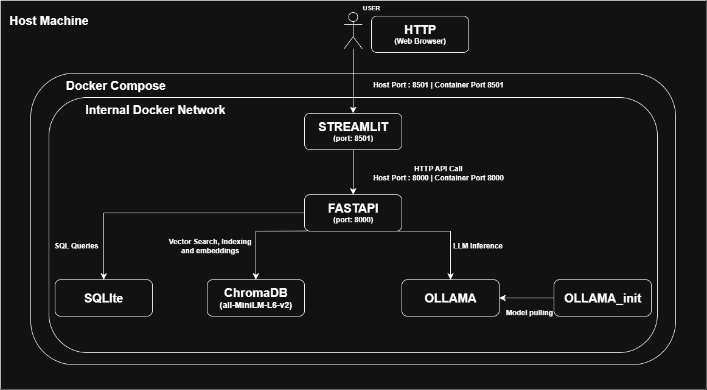
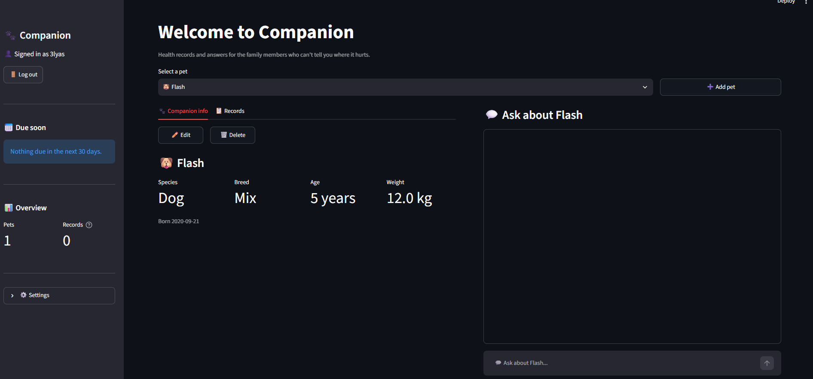
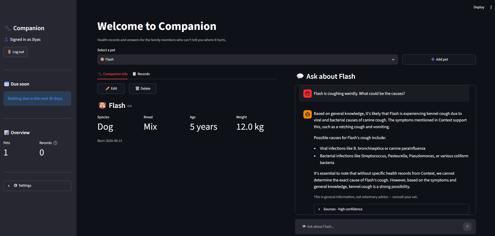
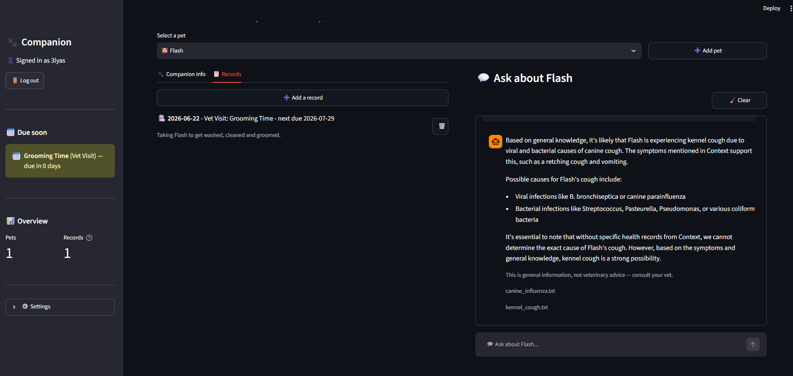

# 🐾 Companion — AI-Powered Pet Health Tracker

A multi-user pet health record system. Owners log vaccinations, vet visits, medications,
weight and symptoms, then ask an AI assistant questions about their pet's care — answered
from a curated veterinary reference corpus and grounded in that pet's own history.

Module 9 Capstone.

---

## Architecture



Four Compose services on a single internal Docker network. Only Streamlit (8501) and
FastAPI (8000) are published to the host.

| Component | Role |
|---|---|
| Streamlit | UI — auth, pet management, record timeline, chat |
| FastAPI | REST API, JWT auth, business logic, RAG orchestration |
| SQLite | Relational store: users, pets, health records, activity log, chat history |
| ChromaDB | Vector store for the pet-care corpus (`all-MiniLM-L6-v2` embeddings) |
| Ollama | LLM inference (`llama3.2:1b` by default) |
| ollama-init | One-shot service that pulls the model, then exits |

Embeddings come from ChromaDB's default embedding function, not Ollama. Ollama handles
generation only.

---

## Tech stack

| Layer | Technology |
|---|---|
| API | FastAPI, Uvicorn |
| Validation | Pydantic v2 |
| ORM / database | SQLAlchemy 2.0, SQLite |
| Auth | JWT (python-jose), bcrypt via passlib, OAuth2 bearer |
| Rate limiting | slowapi |
| Vector store | ChromaDB with `all-MiniLM-L6-v2` embeddings |
| LLM | Ollama running `llama3.2:1b` |
| Frontend | Streamlit |
| Orchestration | Docker Compose |
| Testing | pytest, FastAPI TestClient |
| CI | GitHub Actions — pytest, ruff, Docker build |

---

## Prerequisites

- **Docker Desktop** 4.x or newer, running. Everything else — Ollama, the model, ChromaDB —
  runs in containers; nothing needs installing on the host.
- **~4 GB free disk** for the model, images and vector store.
- **Python 3.11+** only if you want to run the test suite outside Docker. The containers
  use 3.11.

---

## Quick start

```bash
cp .env.example .env
python -c "import secrets; print(secrets.token_hex(32))"   # paste into SECRET_KEY
docker compose up --build
```

- Frontend — http://localhost:8501
- API docs — http://localhost:8000/docs

**First boot takes 3–5 minutes.** It downloads the model (~1.3 GB), fetches the embedding
model, and indexes 946 corpus chunks. The backend reports `starting` during this, which is
expected — the healthcheck has a 120-second grace period. Later boots skip all of it
because the volume persists both.

---

## Usage

**1. Create an account.** Register with a username, email and password (8+ characters).
You're signed in immediately.

**2. Add a pet.** Click **➕ Add pet** beside the selector. Name and species are required;
breed, birth date and weight are optional. Species is limited to Dog and Cat because the
corpus covers only those.

**3. Log health records.** On the **📋 Records** tab, **➕ Add a record** opens a form. Pick
a type — Vaccination, Vet Visit, Medication, Weight or Symptom — and give it a title and
date. Set a next due date only if the entry needs a follow-up; leave it blank for one-off
events like a symptom. Anything due within 30 days appears under **📅 Due soon** in the
sidebar, overdue items in red.

**4. Ask questions.** Use the chat panel on the right. Questions are answered from the
veterinary corpus and grounded in that pet's records:

> *Why is Flash coughing?* · *What vaccinations does my kitten need?* ·
> *What should I feed a senior cat?*

Each answer expands to show which corpus documents it drew on and a confidence level.
Out-of-scope questions are declined rather than guessed at. Conversations are stored per pet
and survive refreshes; **🧹 Clear** wipes one, and **✕** on any question removes that
exchange.

**Ingesting documents.** The corpus in `backend/docs/` is indexed automatically on first
startup — no action needed. To re-index after changing the files:

```bash
curl -X POST http://localhost:8000/ingest -H "Authorization: Bearer <your-token>"
```

Grab a token from `/docs` → `POST /auth/login` → *Try it out*. Re-indexing is safe to
repeat: chunk IDs are `filename:index`, so it overwrites rather than duplicating.

---

## Configuration

All settings come from `.env`. No hosts or secrets are hardcoded.

| Variable | Default | Purpose |
|---|---|---|
| `SECRET_KEY` | — | JWT signing key. **Generate your own.** |
| `ALGORITHM` | `HS256` | JWT algorithm |
| `ACCESS_TOKEN_EXPIRE_MINUTES` | `30` | Token lifetime |
| `DATABASE_URL` | `sqlite:////data/companion.db` | Four slashes = absolute path into the volume |
| `OLLAMA_URL` | `http://ollama:11434` | Docker service name, not localhost |
| `MODEL_NAME` | `llama3.2:1b` | Generation model — see below |
| `CHROMA_PATH` | `/data/chroma` | Vector store location |
| `COLLECTION_NAME` | `documents` | Chroma collection |
| `MAX_RESULTS` | `5` | Chunks retrieved per question |
| `CONFIDENCE_THRESHOLD` | `1.2` | Max distance before a question is refused |
| `DOCS_DIRECTORY` | `./docs` | Corpus location inside the container |
| `DEBUG` | `false` | Prints resolved config at startup |
| `API_URL` | `http://backend:8000` | Frontend → backend |

### Choosing a model

`MODEL_NAME` is the only thing that needs changing, and `ollama-init` pulls whatever it's
set to:

| Model | Size | Prompt eval | Grounding quality |
|---|---|---|---|
| `llama3.2:1b` | 1.3 GB | ~6 s | Adequate; see Known limitations |
| `llama3.2:3b` | 2.0 GB | ~15–20 s | Noticeably better |
| `llama3.1:8b` | 4.7 GB | slower still | Best of the three |

```bash
# edit MODEL_NAME in .env, then
docker compose up -d --force-recreate ollama-init backend
```

The default is 1b so the whole stack starts quickly on any machine. No code changes.

---

## Database schema

Five tables. `users` owns everything; deleting a user cascades to their pets, and deleting
a pet cascades to its records and chat history.

```
users ──1:many──> pets ──1:many──> health_records
  │                 │
  │                 └──1:many──> chat_messages
  └──1:many──> activity_logs
```

### `users`
| Field | Type | Constraints |
|---|---|---|
| `id` | Integer | PK |
| `username` | String(50) | not null |
| `email` | String(100) | unique, not null |
| `hashed_password` | String(255) | bcrypt |
| `created_at` | DateTime | defaults to now |

### `pets`
| Field | Type | Constraints |
|---|---|---|
| `id` | Integer | PK |
| `user_id` | Integer | FK → `users.id`, cascade delete |
| `name` | String(50) | not null |
| `species` | String(50) | not null — Dog or Cat |
| `breed` | String(50) | nullable |
| `birth_date` | Date | nullable |
| `weight` | Float | nullable |
| `created_at` | DateTime | defaults to now |

### `health_records`
| Field | Type | Constraints |
|---|---|---|
| `id` | Integer | PK |
| `pet_id` | Integer | FK → `pets.id`, cascade delete |
| `record_type` | Enum | Vaccination, Vet Visit, Medication, Weight, Symptom |
| `title` | String(100) | not null |
| `description` | Text | nullable |
| `date` | Date | not null |
| `next_due_date` | Date | nullable |
| `created_at` | DateTime | defaults to now |

### `activity_logs`
| Field | Type | Constraints |
|---|---|---|
| `id` | Integer | PK |
| `user_id` | Integer | FK → `users.id`, cascade delete |
| `pet_id` | Integer | FK → `pets.id`, **set null** on delete |
| `action` | String(100) | not null |
| `detail` | String(255) | nullable |
| `timestamp` | DateTime | defaults to now |

Written asynchronously via FastAPI `BackgroundTasks`, and mirrored to `logs/activity.log`.
`pet_id` is deliberately `SET NULL` rather than cascade, so the audit trail survives a pet
being deleted.

### `chat_messages`
| Field | Type | Constraints |
|---|---|---|
| `id` | Integer | PK |
| `pet_id` | Integer | FK → `pets.id`, cascade delete |
| `role` | String(20) | `user` or `assistant` |
| `content` | Text | not null |
| `sources` | Text | JSON array of filenames, nullable |
| `created_at` | DateTime | defaults to now |

---

## API

19 application routes. Auth is a bearer JWT in the `Authorization` header. Every
authenticated route resolves the user from the token and scopes its query to that user's
own rows — you cannot read or modify another user's data.

| Method | Path | Description | Auth |
|---|---|---|---|
| `GET` | `/` | API landing message | No |
| `GET` | `/health` | Health check | No |
| `POST` | `/auth/register` | Create an account, returns a token | No |
| `POST` | `/auth/login` | Exchange email + password for a token | No |
| `GET` | `/auth/me` | Current user | Yes |
| `GET` | `/pets` | List your pets | Yes |
| `POST` | `/pets` | Create a pet | Yes |
| `GET` | `/pets/{pet_id}` | Get one pet | Yes |
| `PATCH` | `/pets/{pet_id}` | Partial update | Yes |
| `DELETE` | `/pets/{pet_id}` | Delete pet and everything under it | Yes |
| `GET` | `/pets/{pet_id}/records` | List health records | Yes |
| `POST` | `/pets/{pet_id}/records` | Add a health record | Yes |
| `PATCH` | `/records/{record_id}` | Partial update | Yes |
| `DELETE` | `/records/{record_id}` | Delete a record | Yes |
| `POST` | `/ask` | Ask about a pet — streams NDJSON | Yes |
| `GET` | `/pets/{pet_id}/messages` | Chat history for a pet | Yes |
| `DELETE` | `/messages/{message_id}` | Delete one message | Yes |
| `DELETE` | `/pets/{pet_id}/messages` | Clear a conversation | Yes |
| `POST` | `/ingest` | Re-index the corpus | Yes |

Updates are `PATCH` only — there is no full-replace `PUT`, so update schemas have
all-optional fields applied with `exclude_unset=True`.

Registration is rate-limited to 5/min and login to 10/min via slowapi.

### `/ask` response format

Streams `application/x-ndjson`, one JSON object per line:

```
{"token": "Kennel"}
{"token": " cough"}
...
{"meta": {"sources": ["kennel_cough.txt"], "confidence": "high", "distances": [0.58]}}
```

If retrieval finds nothing above the confidence threshold, it returns plain JSON instead
and never calls the LLM:

```json
{"answer": "I don't have information on that...", "sources": [], "confidence": "none"}
```

---

## RAG pipeline

**Corpus** — 34 plain-text documents, 946 chunks, roughly 160 pages, covering vaccination
schedules, parasites, dental care, nutrition, life stages, common canine and feline
conditions, and emergency care. **Dogs and cats only**; human-medicine material was
filtered out deliberately, since a passage about human nephrology retrieves with an
excellent score for "my cat's kidney problem" and is entirely wrong.

**Chunking** — one chunk per paragraph, minimum 60 characters. Each chunk is prefixed with
its own `Article - Section` heading, so citations read `Canine distemper - Prevention`
rather than a bare filename, and the heading words contribute to the embedding.

**Retrieval** — top `MAX_RESULTS` chunks by cosine distance, anything above
`CONFIDENCE_THRESHOLD` discarded. Measured on this corpus:

| Query type | Best distance |
|---|---|
| Real pet questions | 0.49 – 0.88 |
| Off-topic questions | 1.47 – 1.77 |

The 1.2 threshold sits in that gap, so "how do I fix my car engine" is refused before
reaching the model.

**Query rewriting** — the pet's name is swapped for its species before querying Chroma.
This matters more than it sounds: `"why is flash coughing weirdly?"` scores **1.302** and
gets refused, because the embedding model reads "Flash" as camera flash or lightning. The
same question as `"why is Dog coughing weirdly? Dog"` scores **0.582**. The original
wording still goes to the LLM; only the retrieval query is rewritten.

**Guardrails**
1. A system prompt that separates CONTEXT (general veterinary material) from PET (this
   animal's records) and forbids diagnosis.
2. The confidence threshold above — out-of-scope questions never reach the model.
3. A non-optional disclaimer rendered by the UI on every answer, rather than requested
   from the model, so it cannot be omitted or reworded.

---

## Testing

```bash
cd backend
python -m pytest tests/ -v
```

13 tests, no Docker or Ollama required — the fixtures point the database, Chroma and the
activity log at a temporary directory, disable rate limiting, and skip the startup ingest.
The RAG success-path test indexes two throwaway documents and monkeypatches generation, so
it exercises retrieval and the streaming response without contacting a model.

Three worth calling out: `test_users_cannot_reach_each_others_pets` proves the JWT is
load-bearing rather than decorative, `test_ask_returns_answer_with_sources` verifies the
full RAG path including citations, and `test_ask_declines_when_corpus_is_empty` exercises
the guardrail as an executable assertion.

CI runs the suite, `ruff`, and a Docker build on every push.

---

## Project structure

```
Companion/
├── docker-compose.yml
├── .env / .env.example
├── architecture.png
├── backend/
│   ├── main.py              app, routers, exception handler, startup ingest
│   ├── config.py            env-backed settings
│   ├── database.py          engine, session, Base, SQLite FK pragma
│   ├── rag.py               chunking, ingest, retrieval, generation
│   ├── models/models.py     5 SQLAlchemy models
│   ├── schemas/             Pydantic request/response models
│   ├── routers/             auth, pets, records, ask, messages
│   ├── utils/               security, limiter, activity, messages, exceptions
│   ├── docs/                the corpus
│   └── tests/
└── frontend/
    ├── app.py               layout and session
    ├── api.py               API client, NDJSON streaming
    └── f_auth_ / f_pets_ / f_records_ / f_chat_
```

---

## Known limitations

**The 1B model attributes corpus material to the pet.** Asked why a pet is coughing, it may
report symptoms such as "runny eyes and sneezing" that appear in the retrieved documents
but not in that animal's records. This was measured, not assumed, and these were ruled out
as causes:

| Attempted fix | Still hallucinated |
|---|---|
| Prompt rewritten to separate CONTEXT from PET | Yes |
| Explicit "never state unless it appears in PET" rule | Yes |
| Temperature lowered to 0.3 | Yes |
| Realistic records instead of sparse ones | Yes |

Holding two context sources apart is a reasoning task, and 1.24 B parameters is not enough
for it. Setting `MODEL_NAME=llama3.2:3b` is the mitigation; the default stays at 1b so the
stack starts quickly for evaluation.

**Chat history is per-pet, not per-conversation** — one continuous thread per animal.

**SQLite is single-writer.** Fine for this scale; moving to Postgres is a `DATABASE_URL`
change and a Compose service, with no code changes.

---

## Troubleshooting

**`docker compose up` fails to connect to the Docker API** — Docker Desktop isn't running.

**Backend shows `unhealthy` on first boot** — expected for the first 1–2 minutes while the
corpus indexes. It flips to `healthy` once the ingest finishes.

**Every question returns "I don't have information on that"** — the corpus didn't index.
Check `docker compose logs backend` for the ingest line, or re-run it:
```bash
curl -X POST http://localhost:8000/ingest -H "Authorization: Bearer <token>"
```

**Answers take 15+ seconds** — normal on CPU. Prompt evaluation dominates; a larger
`MAX_RESULTS` makes it slower.

**Ollama unreachable** — confirm the service is up with
`docker compose exec ollama ollama list`. It should show `MODEL_NAME`.

**"Cannot reach the API"** in the frontend — the backend container isn't up. Check
`docker compose ps`.

---

## Screenshots

**Signed in, pet selected**



**A grounded answer with its sources**



**Records and due-soon tracking**



**Interactive API documentation**


---

## Corpus attribution

All corpus documents derive from English Wikipedia, licensed under
[CC BY-SA 4.0](https://creativecommons.org/licenses/by-sa/4.0/). Text was extracted via the
MediaWiki API, stripped of markup, and reformatted so each paragraph carries its article and
section heading. Per-file source links are in `backend/docs/ATTRIBUTION.md`.