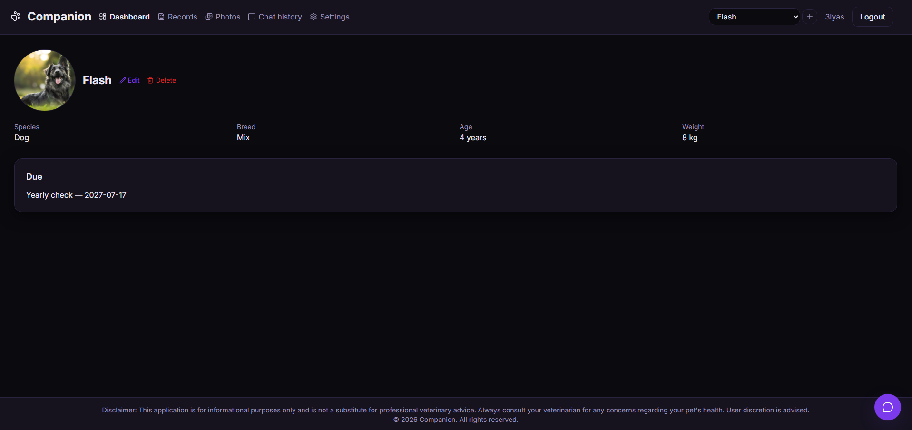
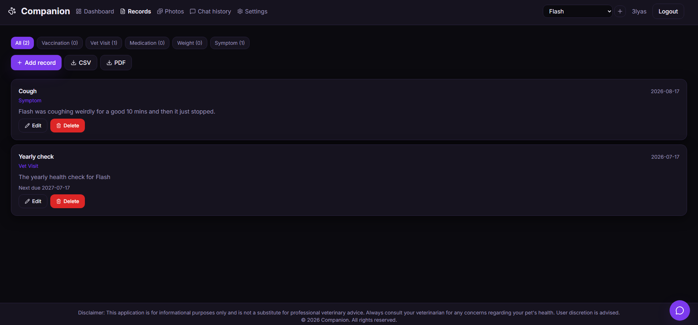
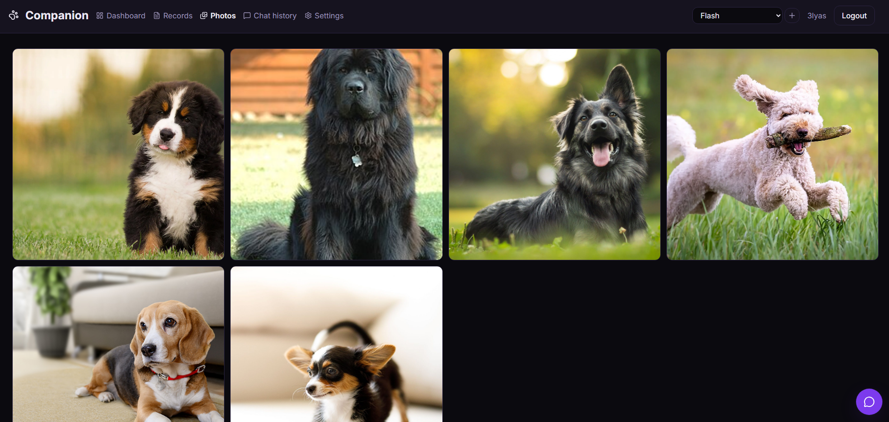
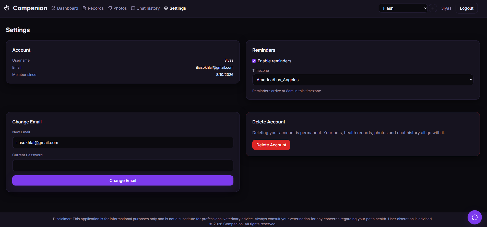
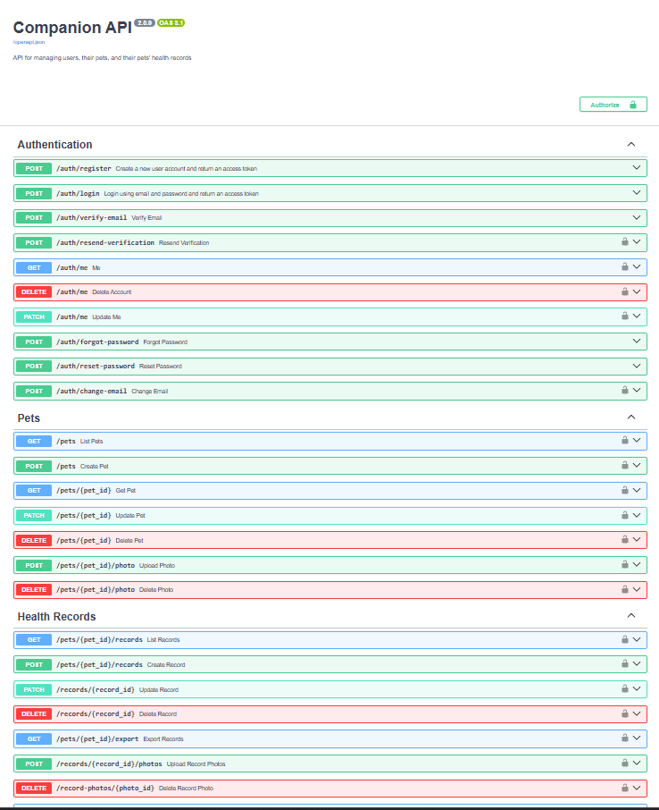

# 🐾 Companion — AI-Powered Pet Health Tracker

**Live at [mycompanion.pet](https://mycompanion.pet)** — running on a Hetzner VPS behind Caddy with automatic TLS.

> **v3 is in progress.** A React Native mobile app is being built in `frontend-mobile/`, and this
> README still describes v2 — the backend, the web frontend and the deployment. Expect the
> repository to contain more than is documented here, and some details to drift as the mobile
> client lands. For a tree that matches this document exactly, see the
> [`v2.0`](https://github.com/Ilyassokhlal/companion-pet-health-tracker/releases/tag/v2.0) tag.

> **v2.** The Module 9 capstone that this project grew out of is preserved at the
> [`v1.0-capstone`](https://github.com/Ilyassokhlal/companion-pet-health-tracker/releases/tag/v1.0-capstone)
> tag, along with the README that describes it.

A multi-user pet health record system. Owners log vaccinations, vet visits, medications,
weight and symptoms, attach photos to any record, and ask an AI assistant questions about
their pet's care — answered from a curated veterinary reference corpus and grounded in that
pet's own history. Due dates turn into email reminders that arrive at 8am in each owner's
own timezone.

---

## Screenshots

**Dashboard**



**Records**



**Chat, answering from the corpus with sources**


**Chat overlays any page**


**Photo gallery, tagged with the record it belongs to**




**Settings**



**Interactive API documentation**



---

## Architecture


Three Compose services on one internal Docker network. In production only 80 and 443 are
published — Caddy terminates TLS, serves the built React app, and reverse-proxies `/api/*`
to the backend, so the API and Postgres are unreachable from outside the host.

| Service | Role |
|---|---|
| `frontend` | Caddy — TLS, the static React build, and the `/api` reverse proxy |
| `backend` | FastAPI — REST API, JWT auth, RAG orchestration, reminder scheduler |
| `db` | PostgreSQL 17 — users, pets, records, photos, chat history |

Because the app and its API share one origin, the browser makes no cross-origin requests
and CORS does not apply in production.

ChromaDB runs in-process inside the backend, and its index lives on the shared `app_data`
volume alongside uploaded photos. Answer generation calls the Claude API; email goes through
Resend. Neither runs locally.

**Volumes** — `db_data` holds the database, `app_data` holds `/data/chroma` and
`/data/photos`, and `caddy_data` holds the TLS certificates. That last one is load-bearing:
without it every restart re-requests a certificate, and Let's Encrypt allows five per domain
per week.

Local development publishes 5432 and 8000 via `docker-compose.override.yml`, which Compose
loads automatically by filename and which is deliberately not committed.

---

## Tech stack

| Layer | Choice |
|---|---|
| Frontend | React + TypeScript, Vite, Tailwind CSS v4, React Router, lucide-react |
| Web server | Caddy |
| API | FastAPI, Pydantic v2, SQLAlchemy 2, Alembic |
| Database | PostgreSQL 17 |
| Vector store | ChromaDB (`all-MiniLM-L6-v2` embeddings) |
| LLM | Claude Haiku 4.5 via the Anthropic API |
| Email | Resend |
| Scheduling | APScheduler |
| Export | `fpdf2` for PDF, `csv` for CSV |
| Tests | pytest against a real PostgreSQL database |

---

## Why the Claude API

Earlier versions ran inference locally with Ollama. This app is deployed with Docker on a VPS,
and hosting an entire model there would require a lot of VRAM — enough to push the monthly
server cost past what the project justifies. Moving generation to the Claude API is the
compromise that made deployment viable.

It is meant to be temporary. Returning to an isolated model is the intended direction, and the
code is shaped for it: `rag.generate` is a generator that yields text chunks, so switching back
means rewriting that one function and `MODEL_NAME` — nothing upstream in `ask.py` changes.

---

## Prerequisites

- Docker and Docker Compose
- An [Anthropic API key](https://console.anthropic.com)
- A [Resend](https://resend.com) API key and a verified sending domain

Email is optional for local development — the app runs without it, but verification,
password reset and reminders will silently do nothing.

---

## Quick start

```bash
git clone https://github.com/Ilyassokhlal/companion-pet-health-tracker.git
cd companion-pet-health-tracker
cp .env.example .env
```

Fill in `.env`: at minimum `SECRET_KEY`, `POSTGRES_PASSWORD`, a matching password inside
`DATABASE_URL`, and `ANTHROPIC_API_KEY`.

```bash
docker compose up --build
```

Then open **http://localhost**.

First boot takes a few minutes: the backend downloads the embedding model and indexes the
corpus, and the frontend runs a production build. Database migrations run automatically on
every backend start.

---

## Configuration

All settings live in `.env`. `.env.example` lists every key with a safe default.

| Variable | Purpose |
|---|---|
| `SECRET_KEY` | JWT signing key. Change it. |
| `ACCESS_TOKEN_EXPIRE_MINUTES` | Session lifetime. Default 10080 (7 days). |
| `POSTGRES_USER` / `POSTGRES_PASSWORD` / `POSTGRES_DB` | Database container initialisation |
| `DATABASE_URL` | The app's connection string. Its password must match `POSTGRES_PASSWORD`. |
| `ANTHROPIC_API_KEY` | Required — the backend fails to start without it |
| `MODEL_NAME` | Default `claude-haiku-4-5` |
| `RESEND_API_KEY` / `MAIL_FROM` | Outbound email. `MAIL_FROM` must be on a domain verified with Resend. |
| `FRONTEND_URL` | Used to build verification and password-reset links |
| `CORS_ORIGINS` | Comma-separated origins allowed to call the API |
| `VITE_API_URL` | Baked into the frontend bundle **at build time** — changing it needs a rebuild |
| `PHOTO_DIR` / `MAX_PHOTO_MB` | Photo storage path and per-file size cap |
| `REMINDER_HOUR` / `REMINDER_LEAD_DAYS` | When digests go out, and how far ahead they look |
| `TIMEZONE` | Fallback for users who haven't chosen one |
| `MAX_RESULTS` / `CONFIDENCE_THRESHOLD` | RAG retrieval. See the threshold note below before changing. |

---

## Database schema

Five tables. Every foreign key cascades, so deleting a user removes everything they own.

```
users ──1:many──> pets ──1:many──> health_records ──1:many──> record_photos
                    └──1:many──> chat_messages
```

### `users`
`id` · `username` · `email` (unique) · `hashed_password` · `email_verified` ·
`reminders_enabled` · `timezone` · `created_at`

Login is by email; usernames are display-only and need not be unique.

### `pets`
`id` · `user_id` → users · `name` · `species` · `breed` · `birth_date` · `weight` ·
`photo_filename` · `created_at`

### `health_records`
`id` · `pet_id` → pets · `record_type` · `title` · `description` · `date` ·
`next_due_date` · `reminder_sent_at` · `created_at`

`record_type` is an enum: Vaccination, Vet Visit, Medication, Weight, Symptom.
`reminder_sent_at` is the idempotency marker that stops a digest being sent twice.

### `record_photos`
`id` · `record_id` → health_records · `filename` · `created_at`

Several photos per record — a wound from three angles, or a medication label.

### `chat_messages`
`id` · `pet_id` → pets · `role` · `content` · `sources` · `created_at`

`sources` is JSON: each citation carries the article title, section and a deep link.

---

## API

31 endpoints. Interactive documentation at **http://localhost/api/docs** locally, or
**https://mycompanion.pet/api/docs** on the live site.

### Auth
| Method | Path | Notes |
|---|---|---|
| POST | `/auth/register` | Returns a token; sends a verification email |
| POST | `/auth/login` | Email and password |
| GET | `/auth/me` | Current user |
| PATCH | `/auth/me` | Update preferences — reminders, timezone |
| DELETE | `/auth/me` | Delete the account. Requires the current password. |
| POST | `/auth/verify-email` | Unauthenticated — the signed token is the proof |
| POST | `/auth/resend-verification` | Authenticated, rate limited to 3/hour |
| POST | `/auth/forgot-password` | Always 204, whether or not the address exists |
| POST | `/auth/reset-password` | Single-use link; consumed once the password changes |
| POST | `/auth/change-email` | Requires the current password; re-triggers verification |

### Pets
| Method | Path |
|---|---|
| GET / POST | `/pets` |
| GET / PATCH / DELETE | `/pets/{pet_id}` |
| POST / DELETE | `/pets/{pet_id}/photo` |

### Records
| Method | Path |
|---|---|
| GET / POST | `/pets/{pet_id}/records` |
| PATCH / DELETE | `/records/{record_id}` |
| GET | `/pets/{pet_id}/export?format=csv\|pdf` |

### Photos
| Method | Path |
|---|---|
| POST | `/records/{record_id}/photos` — accepts several files per request |
| DELETE | `/record-photos/{photo_id}` |
| GET | `/pets/{pet_id}/photos` — the gallery, joined to each record's title and date |

Image files are served as static assets from `/photos/<filename>`, under unguessable UUID
names.

### Chat
| Method | Path |
|---|---|
| POST | `/ask` — streams newline-delimited JSON |
| GET | `/pets/{pet_id}/messages` |
| DELETE | `/messages/{message_id}` |
| DELETE | `/pets/{pet_id}/messages` |

### Other
| Method | Path |
|---|---|
| GET | `/health` |
| POST | `/ingest` — re-index the corpus |

### `/ask` response format

The endpoint streams `application/x-ndjson`, one JSON object per line:

```
{"token": "Heartworm "}
{"token": "prevention "}
{"meta": {"sources": [{"title": "Dirofilaria immitis", "section": "Treatment and prevention", "url": "https://en.wikipedia.org/wiki/Dirofilaria_immitis#Treatment_and_prevention"}], "confidence": "high"}}
```

Out-of-scope questions never reach the model and return a plain JSON object instead of a
stream, so clients must check the response's content type before parsing.

---

## RAG pipeline

**Corpus** — 35 plain-text documents, 1000 chunks, roughly 170 pages, covering vaccination
schedules, parasites, dental care, nutrition, life stages, common canine and feline
conditions, and emergency care. **Dogs and cats only**; human-medicine material was filtered
out deliberately, since a passage about human nephrology retrieves with an excellent score
for "my cat's kidney problem" and is entirely wrong.

**Chunking** — one chunk per paragraph, minimum 60 characters. Each chunk is prefixed with
its own `Article - Section` heading, so citations read `Canine distemper - Prevention` rather
than a bare filename, and the heading words contribute to the embedding. Titles and URLs are
parsed from `backend/docs/ATTRIBUTION.md` at index time, which is what lets a citation link
to the exact section of the source article.

**Retrieval** — two queries, because scope-checking and chunk-selection want different things.

The pet's **name is swapped for its species** in both. This matters more than it sounds:
`"why is Flash coughing?"` scores **1.302** and gets refused, because the embedding model
reads "Flash" as camera flash or lightning. As `"why is Dog coughing?"` it scores **0.537**.

The **gate query** stops there and decides whether the question is in scope at all:

| Query type | Best distance |
|---|---|
| Real pet questions | 0.45 – 0.99 |
| Off-topic questions | 1.47 – 1.74 |

The 1.2 threshold sits in that gap, so "how do I renew my passport" is refused before
reaching the model.

The **retrieval query** additionally appends the species, which is what keeps dog and cat
material apart. For a cat, `"What should I feed my pet?"` retrieves `dog_food.txt` without it
and `cat_food.txt` with it — the difference between correct advice and confidently wrong
advice.

That suffix can't be used for the gate, though. One domain word pulls *any* question toward a
corpus that is entirely about dogs and cats: "What is the capital of France?" drops from
**1.471** to **1.038**, under the threshold, and would be answered. Real questions barely
move, since they're already close. Splitting the two queries keeps the species targeting
without eroding the guardrail, at the cost of one extra ChromaDB lookup.

The original question wording always goes to the model; only the retrieval queries are
rewritten.

**Guardrails**

1. A system prompt that separates CONTEXT (general veterinary material) from PET (this
   animal's records) and forbids diagnosis.
2. The confidence threshold above — out-of-scope questions never reach the model.
3. A non-optional disclaimer rendered by the UI on every answer, rather than requested from
   the model, so it cannot be omitted or reworded.

---

## Reminders

A record with a `next_due_date` produces one email digest per owner, listing everything due
within `REMINDER_LEAD_DAYS` — overdue items included.

The scheduler runs **hourly**, not daily. Each run sends only to users for whom it is
currently `REMINDER_HOUR` in *their* timezone, because a single daily job can only ever be
8am in one place. Users choose their timezone in Settings; the browser's zone is used as the
default at registration.

Digests only go to verified addresses with reminders enabled, and `reminder_sent_at` is
written only after a successful send — so a mail outage retries rather than silently burning
the reminder.

---

## Testing

```bash
docker compose exec backend python -m pytest tests -v
```

15 tests against a real PostgreSQL database. The suite creates and drops every table per
test, so it uses a separate `companion_test` database:

```bash
docker compose exec db psql -U companion -d postgres -c "CREATE DATABASE companion_test OWNER companion;"
```

Outbound email is stubbed by an autouse fixture, so no test ever calls Resend. The Chroma
collection is empty during tests, which means `/ask` takes its refusal branch and never calls
the Claude API — the suite costs nothing to run.

CI runs the same suite against a `postgres:17` service container, plus `ruff` and a Docker
build, on every push.

---

## Project structure

```
backend/
  alembic/            migrations
  docs/               the corpus, plus ATTRIBUTION.md
  models/             SQLAlchemy models
  routers/            auth, pets, records, messages, ask
  schemas/            Pydantic request and response models
  tests/
  utils/              security, mailer, photos, export, reminders, exceptions
  config.py           settings from environment
  database.py         engine and session
  rag.py              chunking, ingest, retrieval, generation
  main.py             app wiring, CORS, static mount, scheduler

frontend-web/
  src/
    api/              one module per resource; all HTTP lives here
    auth/             AuthContext
    context/          PetContext — current pet, shared across pages
    components/       Header, Footer, forms, ChatFAB
    components/ui/    Button, Input, Section, ConfirmDialog
    pages/            Landing, Login, Register, Verify, Forgot, Reset,
                      Dashboard, Records, Photos, ChatHistory, Settings
  Caddyfile           static serving with SPA fallback
  Dockerfile          Node build stage, Caddy serving stage
```

---

## Known limitations

- **Sessions are 7-day JWTs in `localStorage`.** There is no refresh-token flow. Changing a
  password invalidates every existing session, which covers the important case.
- **The reminder scheduler runs in-process.** Two backend replicas would send two digests;
  it needs extracting into its own service before scaling out.
- **Photos are protected by unguessable filenames, not authorisation.** Anyone holding a URL
  can view that image. Acceptable for pet photos, not for anything sensitive.
- **PDF export is text-only** and its font is Latin-1, so non-Latin characters degrade to
  `?`.
- **The corpus covers dogs and cats only.** Other species are refused by design rather than
  answered badly.
- **No pagination.** Records and photos load in full; fine for hundreds, not thousands.

---

## Troubleshooting

**Backend exits immediately** — check `ANTHROPIC_API_KEY` is set. The Claude client is
constructed at import time and raises without one.

**`password authentication failed for user "companion"`** — the password inside
`DATABASE_URL` doesn't match `POSTGRES_PASSWORD`. Note that `POSTGRES_PASSWORD` only takes
effect when the database volume is first created; changing it later requires
`docker compose down && docker volume rm companion_db_data`.

**Environment changes seem to be ignored** — `docker compose restart` reuses the existing
container's environment. Use `docker compose up -d --force-recreate` instead.

**The frontend shows old code** — `VITE_API_URL` and the whole bundle are baked in at build
time. Rebuild with `docker compose up -d --build frontend`.

**No emails arrive** — sends are background tasks that swallow their errors. Check
`docker compose logs backend` for the real failure, and confirm `MAIL_FROM` is on a domain
verified with Resend.

---

## Corpus attribution

All corpus documents derive from English Wikipedia, licensed under
[CC BY-SA 4.0](https://creativecommons.org/licenses/by-sa/4.0/). Text was extracted via the
MediaWiki API, stripped of markup, and reformatted so each paragraph carries its article and
section heading. Per-file source links are in `backend/docs/ATTRIBUTION.md`.